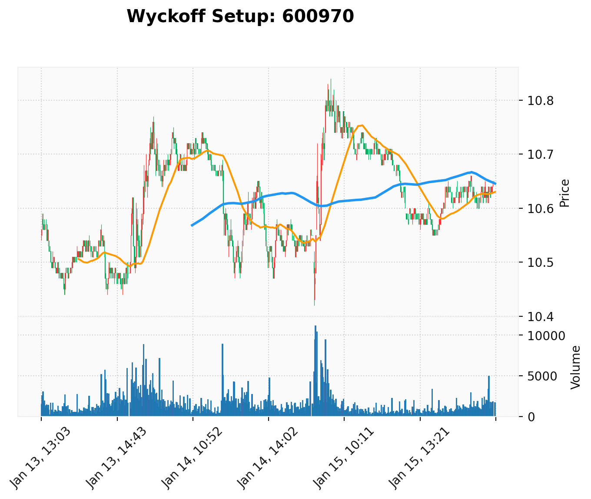

我是理查德·D·威科夫。针对目标标的 600970 在 2026年1月13日至1月15日期间的量价表现，我已完成对“综合人”（Composite Man）意图的深度研判。

以下是基于威科夫逻辑的分析报告：

### 1. Background & Trend
**当前环境：从震荡区间（TR）向趋势发起的转换阶段。**

*   **趋势判断**：在 1月13日至14日，市场处于一个明显的水平交易区间（TR），价格在 10.44 至 10.77 之间反复拉锯。
*   **供求关系**：1月14日午后出现明显的供应放量（13:01，成交量 8930），导致价格回落至 10.50 附近。然而，1月15日早盘的剧烈波动改变了性质。目前，需求（Demand）在 10.42 附近成功吸收了所有恐慌性供应，供求天平已向需求方倾斜。
*   **均线参考**：最新价格 10.66 已站上 MA50 (10.63) 且接近 MA200 (10.64)，这表明短期强势正在修复长期弱势。

### 2. Key Wyckoff Events
通过对数据附件的审视，我识别出以下关键量价行为：

1.  **恐慌性测试与弹簧效应（Spring）**：
    *   **证据**：**2026-01-15 09:31 至 09:33**。
    *   **量价描述**：价格在 09:31 瞬间击穿前期所有支撑，低见 **10.42**。此时成交量急剧放大（5500 -> 9449 -> 11158），这是典型的“努力”（Effort）。
    *   **结果**：如此巨大的抛售努力，价格却在 09:34 迅速收回至 10.63。这说明“综合人”在此价位下方布置了大量买单，吸收了所有恐慌盘。这是一个教科书级的 **Spring（弹簧）** 行为。

2.  **强势信号（SOS）与供应衰竭**：
    *   **证据**：**2026-01-15 09:46**。
    *   **量价描述**：价格放量上涨至 **10.79**，突破了 14 日的高点区域。
    *   **后续**：随后在 10:20 之后，价格虽有回落，但成交量显著萎缩（多在 1000 以下），这证明在 10.60 以上的价位，供应（Supply）已经枯竭。

3.  **努力与结果的违背（Effort vs Result）**：
    *   **证据**：**2026-01-14 13:01**。
    *   **量价描述**：放量（8930）下跌，但价格仅从 10.68 跌至 10.67，随后才缓慢下滑。这说明在 13:01 时已有初步支撑在介入，阻止了价格崩盘。

### 3. Phase Analysis
根据威科夫结构理论，该标的目前处于 **Phase D（派发后的重新吸筹或区间突破阶段）**：

*   **Phase A**：1月13日至14日早盘，通过 SC（恐慌抛售）和 AR（自动反弹）确立了 TR 的边界（10.44 - 10.77）。
*   **Phase B**：1月14日全天的震荡，消耗了多空双方的力量。
*   **Phase C**：**1月15日 09:31 的 10.42 低点**。这是对区间底部的终极测试（Spring），确认了市场上没有剩余供应。
*   **Phase D**：当前阶段。价格正在 TR 内部由下向上沿“阻力最小线”移动。10.66 附近的横盘属于 **LPS（最后支撑点）** 的构建，旨在消化 10.70 上方的残余阻力。

### 4. Trading Strategy
作为“综合人”，我的意图已经非常明确：**吸筹已进入尾声，准备脱离 TR 进入 Phase E（上升趋势）**。

*   **操盘意图**：清洗掉在 10.42 附近没有被震出来的最后一部分浮筹，随后拉升。
*   **买入建议**：
    *   **进场点**：当前 10.66 附近可建立底仓。若价格回踩 **10.60 - 10.62** 区域且缩量，是极佳的加仓点（LPS 测试）。
    *   **确认点**：放量突破 **10.84**（前期高点）时，确认趋势开启。
*   **止损设置**：止损位必须设在 Spring 的起始位置下方，即 **10.40**。如果价格跌破此位，说明吸筹失败，供应依然庞大。
*   **目标**：首个目标位观察前期派发压力区，但基于 Spring 的力度，预期将有一波脱离 TR 的快速上涨。

**谨记：永远跟随大资金的足迹，不要在供应尚未枯竭时盲目入场。**